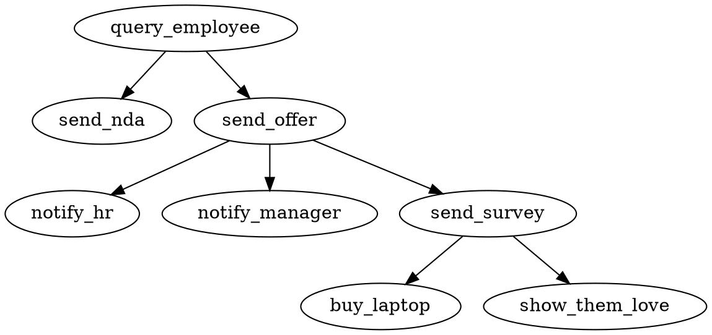

# Offer and On Boarding

This flow is used to onboard new employees to Breadboard Inc.

## Flow



### Find Employee

Look up the employee information based on _greenhouse_ id.

```javascript
/*
  @pragma flow query_employee
*/
module.exports = (req, res) => res.send({
  'name'    : 'Ahmed Kamel',
  'email'   : 'ahmed.kamel@gmail.com',
  'phone'   : '+12532143749',
  'manager' : {
    'name'  : 'Tom',
    'phone' : '+12532143749'
  }
});
```

### Send NDA

Send the candidate the NDA document

```javascript
/*
  @pragma flow send_nda
*/
module.exports = (req, res, next) => {
  let { name, email } = req.body;

  let payload =
  {
      templateId    : `[NDA ID]`
    , emailSubject  : 'Hi ${name}, please sign this NDA'
    , roles         : [{
        roleName    : 'integrator'
      , name        : name
      , email       : email
    }]
  };

  req
    .app
    .docusign
    .sendTemplate(payload)
    .asCallback(next);
};
```

### Send Offer Letter

Send the candidate the NDA document

```javascript
/*
  @pragma flow send_offer
*/
module.exports = (req, res, next) => {
  let { name, email } = req.body;

  let payload =
  {
      templateId    : `[Offer Letter ID]`
    , emailSubject  : 'Hi ${name}, review and sign your DocuSign offer letter'
    , roles         : [{
        roleName    : 'integrator'
      , name        : name
      , email       : email
    }]
  };

  req
    .app
    .docusign
    .sendTemplate(payload)
    .return(req.body)
    .asCallback(next);
};
```

### Notify HR

Notify HR of offer acceptance or rejection

```javascript
/*
  @pragma flow notify_hr
*/
module.exports = (req, res, next) => {
  let { name, email } = req.body;

  req
    .app
    .email
    .send({
        to      : email
      , from    : 'hr@breadboard.io'
      , subject : `${name} accepted offer`
      , text    : `${name} accepted offer letter`
    })
    .asCallback(next);
};
```

### Notify Manager

Notify Hiring Manager of offer acceptance or rejection

```javascript
/*
  @pragma flow notify_manager
*/
module.exports = (req, res, next) => {
  let { name, manager : { phone } } = req.body;

  req
    .app
    .sms
    .send({
        'to' : phone,
        'body' : `${name} will be joining your team`
      })
      .asCallback(next);
};
```

### New Hire Survey

Send the new hire survey in case of offer acceptance.

```javascript
/*
  @pragma flow send_survey
*/
// todo [akamel] send offer survey
module.exports = (req, res) => res.send('send_survey');
```

### Buy Laptop

Buy the new hire a laptop based on their survey results.

```javascript
/*
  @pragma flow buy_laptop
*/
// todo [akamel] send offer survey
module.exports = (req, res) => res.send('buy_laptop');
```

### Show Them Love

It's nice to show your new hires some love... Send them a gift, call them up, ...

```javascript
/*
  @pragma flow show_them_love
*/
module.exports = (req, res, next) => {
  let { name, email, phone } = req.body;

  req
    .app
    .phone
    .send({
        'to'    : phone,
        'twiml' : `<?xml version='1.0' encoding='UTF-8'?>
                  <Response>
                  	<Gather timeout='10' finishOnKey='*'>
                  		<Say>Hi ${name}, Please enter your pin number and then press star.</Say>
                  	</Gather>
                  </Response>`
      })
      .asCallback(next);
};
```
